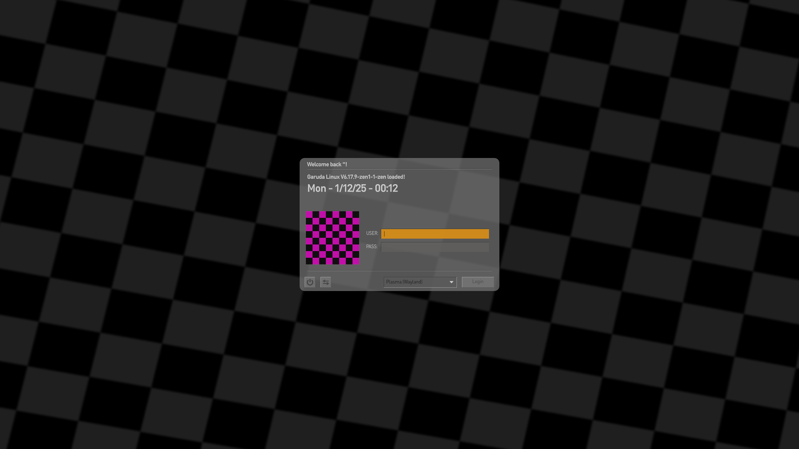
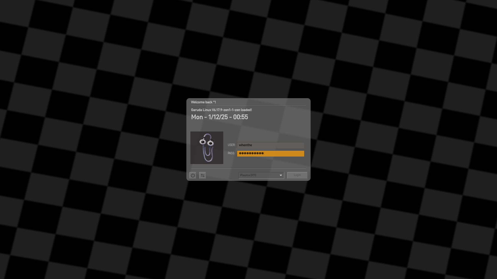

# Sourced
An SDDM Theme inspired by Sourcebox (Interloper).

## Features
- Interface theme inspired after the source engine.
- SFX based on Sourcebox.
- Basic SDDM features (Power options, session manager, logging in).

## Configuration

This theme comes with a few configuration options you can tweak to your liking. Listed are each option and what they do:

- userAvatarRendering
  - Enables or disables the account avatar portrait (Default: true)
- loginFlickering
  - Enables or disables the flickering effect when submitting login credentials (Default: true)
- Individual Volume controls
  - Each entry corresponds to their respective audio's volume, which can range from 0 (Muted) to 1 (Loudest) (Default: 0.5)
- Individual Audios Overrides
  - Each entry allows you to specify a filepath to an audio file of your choosing (Default: "")
  - Note: It is recommended to utilize compressed audio files when specifying the backgroundTheme, while using uncompressed audio files for the others.
- newSrcboxTheme
  - Choose whether to use the compressed or uncompressed variant of the sourcebox theme. Overriden by any custom background theme you specify (0 - Compressed; 1 - Uncompressed, default: 0)

## Credits
Forked from SDDM Theme ["Reactionary"](https://www.pling.com/p/2138257) by [phob1an](https://www.opencode.net/phob1an). Asset changes and further functionalities by me.
Interloper made by Anomidae.
